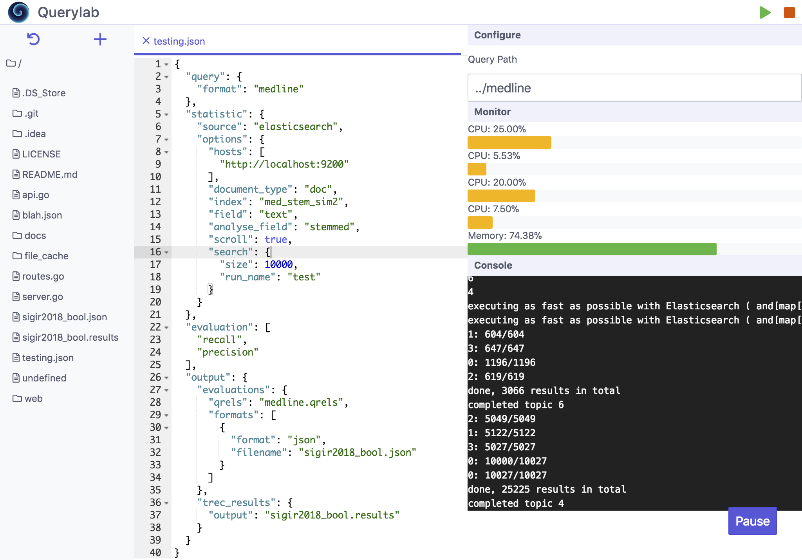

# Querylab



Querylab is a framework for constructing and executing information retrieval experiment pipelines. The framework as a whole is built primarily for domain specific applications such as medical literature search for systematic reviews, or finding factually or legally applicable case law in the legal domain; however it can also be used for more general tasks. There are a number of pre-implemented components that enable common information retrieval experiments such as ad-hoc retrieval or query analysis through query performance predictors. In addition, this collection of tools seeks to be user friendly, well documented, and easily extendible. Finally, the entire pipeline can be distributed as a single binary with no dependencies, ready to use with a simple domain specific language (DSL) for constructing pipelines.

## Links

 - [Project website](https://ielab.io/querylab)
 - [Documentation](https://godoc.org/github.com/ielab/querylab)
 
## Cite

If you use this work, please cite as:

```
@inproceedings{scells2018querylab,
Author = {Scells, Harrisen and Zuccon, Guido and Locke, Daniel},
Booktitle = {Proceedings of the 41st international ACM SIGIR conference on Research and development in Information Retrieval},
Organization = {ACM},
Title = {An Information Retrieval Experiment Framework for Domain Specific Applications},
Year = {2018}
}
```